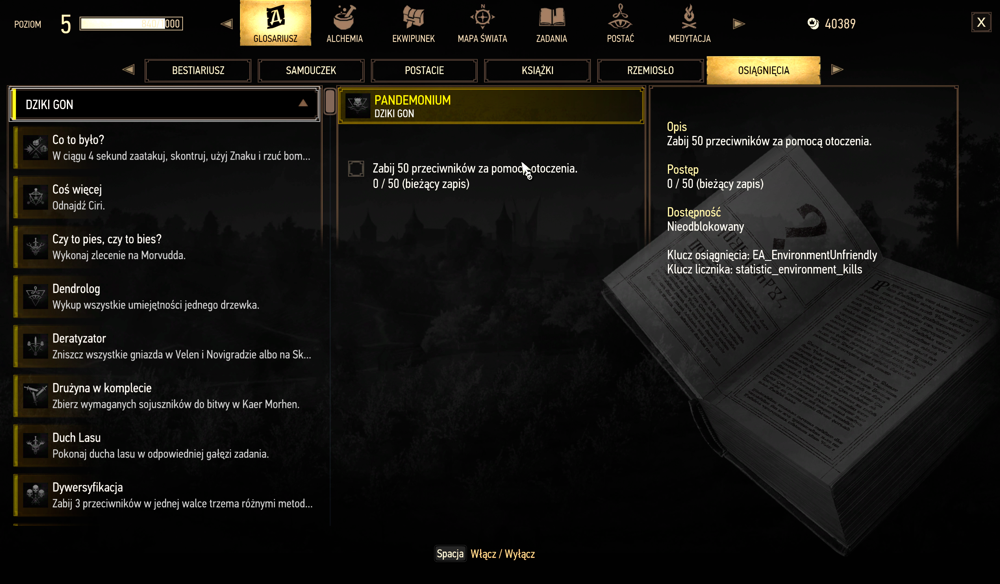
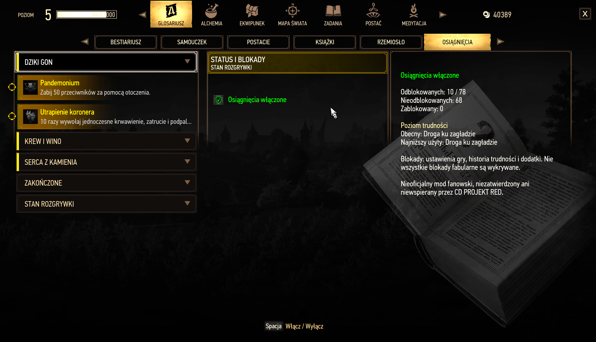
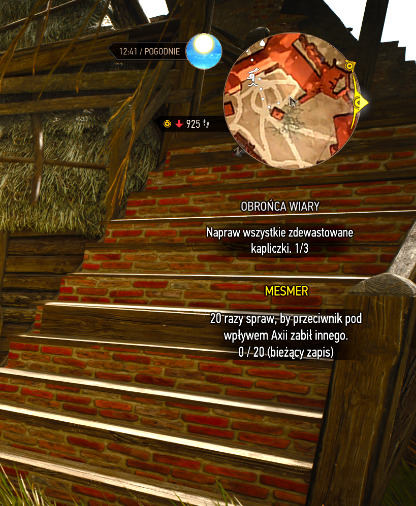

# Witcher3ModsAchievementPanel

Witcher3ModsAchievementPanel is an unofficial fan-made mod that adds an in-game achievement panel to The Witcher 3. Open **Glossary → Achievements**, located after **Crafting**. Select an achievement and use the on-screen tracking action to pin or unpin it.

## Features

### Achievement list and details

Browse all 78 achievements from the base game and expansions by category, and inspect each one's description, progress and availability.

### Tracking, status and restrictions

Pin up to three achievements, keep them visible in collapsed categories (pinned ones sort first), and check your achievement status, difficulty and known restrictions.

### Live HUD progress

Pinned achievements and their updating progress counters show during gameplay, below your quest objectives.

### Also

- Keyboard, mouse and controller navigation.
- Polish text when the game's text language is Polish, English otherwise.
- Pins and category choices are saved in your user settings and shared across saves. Persistence across game restarts still needs in-game verification.
- Read-only display: the mod never unlocks achievements or changes your tracked quest.

Compatibility: the unlock interpretation was checked against Steam on the development setup, not on every platform or build. A uniform all-locked or all-unlocked response currently produces a readout error, and story-block detection is incomplete.

## Install automatically (Windows)

1. Close the game. Download the release ZIP from the **Releases** page and extract it anywhere.
2. Open the extracted `modWitcher3ModsAchievementPanel` folder and double-click **`install.cmd`**.
3. The installer finds your Witcher 3 folder (Steam, GOG, Epic or the usual folders on every drive, and it asks for the path if it cannot find it) and replaces any previous version of the mod in `mods`. A copy installed by an earlier release under a misspelled folder name is removed too, so two copies of the scripts never clash.

To remove the mod, double-click **`uninstall.cmd`**, either in the extracted folder or in `mods\modWitcher3ModsAchievementPanel` inside the game folder. It removes the mod folder and your saved pinned achievements (only that mod's section in the `*user.settings` files in `Documents\The Witcher 3`, after making a copy of each file it edits) and nothing else.

Both files are plain text, so you can open them in Notepad and read exactly what they do. Windows SmartScreen may warn about a downloaded script: choose **More info, Run anyway** if you trust it, or install by hand as described below.

## Install or update by hand — Steam

Prefer to do it by hand? Follow these steps instead of `install.cmd`.

Requires the PC next-gen version of The Witcher 3. REDkit is not required to play. Back up your saves and mod installation before updating.

1. Close the game. In Steam, right-click **The Witcher 3 → Manage → Browse local files**.
2. Open or create the `mods` folder. Typical locations:
   - Default: `C:\Program Files (x86)\Steam\steamapps\common\The Witcher 3\mods\`
   - Another Steam library: `D:\SteamLibrary\steamapps\common\The Witcher 3\mods\`
3. For an update, move the previous mod folder **outside `mods`** first. That includes a folder from an earlier release with a slightly different (misspelled) name. Do not merge this modular version with the old single-file version.
4. Copy this repository's entire `src/modWitcher3ModsAchievementPanel` folder into `mods`. If using a release ZIP, copy its top-level `modWitcher3ModsAchievementPanel` folder instead. Its `.ws` files must end up in:
   `mods\modWitcher3ModsAchievementPanel\content\scripts\local\`
5. Launch the game, allow script compilation, and load your save.

To uninstall by hand, close the game and move the panel folder outside `mods`. Keep backups outside that folder too.

## License

Original project material uses the [Personal Noncommercial Use License](LICENSE): source inspection, local builds and modifications for private, noncommercial use with a lawful copy of The Witcher 3. Redistribution requires separate permission, except for rights preserved in LICENSE (including earlier grants and CDPR/platform rights). This is source-available, not MIT or OSI open source; third-party licenses remain separate.

CDPR supplies Flash UI sources for modding in the [REDkit FAQ](https://www.thewitcher.com/us/en/redkit/modding). Use of this mod is limited to noncommercial play within The Witcher 3, subject to the [REDkit EULA](https://store.steampowered.com/eula/2889630_eula_0), [Fan Content Guidelines](https://www.cdprojektred.com/en/fan-content) and applicable game terms. These do not make third-party middleware freely redistributable as a standalone SDK. See [THIRD-PARTY-NOTICES.txt](THIRD-PARTY-NOTICES.txt); both notices and LICENSE accompany the installable mod.

This is an unofficial fan work and is not approved or endorsed by CD PROJEKT RED. Provided **as is, without warranty**, subject to LICENSE and applicable law.
